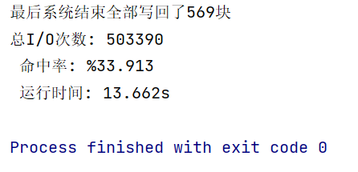

# ustc abd-sse lab2 
## 学号：SA23225137 姓名：李嘉星

### 实验内容

在这个项目中，我们将实现一个简单的存储和缓冲区管理器。
该缓冲区管理器实现了LRU置换算法，frame的大小和磁盘page的大小相同。LRU使用双向链表实现。

### 设计与实现

#### 文件存储格式
在我们的项目中，我们只需要磁盘上的一个物理文件。
数据库中的所有数据都将保存在这个单个文件中。此文件将保存在工作目录中，并将被命名为data.dbf。
这个文件必须存在，即使它是空的，
当系统第一次运行时，这个文件是空的。

这个文件是一个堆文件，该文件存放5万个page，基于目录的结构来组织文件，因此存储管理器根据页号即可快速请求读写指定位置的page。

我们在数据存储管理器DataStorageManager类中提供打开文件的方法:
```java
public int openFile(String fileName){
        try{
            this.currFile = new RandomAccessFile(fileName,"rw");
        } catch (FileNotFoundException e) {
            e.printStackTrace();
            return 0;
        }
        return 1;
    }
```
#### DataStorageManager类的设计与实现
DataStorageManager中有如下成员变量：
```java
    private RandomAccessFile currFile;
    private int numPages;
    private int[] pages;
```
其中currFile用于读写堆data.dbf,numPages用于记录使用了多少个页面,
用pages数组记录对应的页面使用了多少字节。
该类有两个静态变量，用于记录IO次数：
```java
    public static int ICounter = 0;
    public static int OCounter = 0;
```
该类的构造方法如下：
```java
public DataStorageManager() {
        this.numPages = 0;
        this.pages = new int[MAXPAGES];
        currFile = null;
        for(int i = 0;i < MAXPAGES;i++) {
            this.pages[i] = 0; // 初始时，page的useBit = 0,表示未被使用
        }
    }
```
该类提供readPage方法，该方法会被BufferManager类中的fixPage
方法调用，该方法接受一个pageId，对对应的page进行读取，实现如下：
```java
public BFrame readPage(int pageId) throws IOException{
        byte[] buffer = new byte[FRAMESIZE];
        try {
            long pos = (long) pageId * FRAMESIZE;
            currFile.seek(pos);
            int length = currFile.read(buffer, 0, FRAMESIZE);
            if(length == 0)
                System.out.println("未读取到任何内容");
            else if (length == -1)
                System.out.println("文件已读取到末尾");
            ICounter++;
        } catch (IOException e) {
            e.printStackTrace();
            System.out.println("文件读异常");
        }
        return new BFrame(buffer);
    }
```
当页面从缓冲区调出时，会调用写页面的方法writePage写入页面，
```java
public int writePage(int frameId,BFrame frame){
        try {
            this.currFile.seek((long) frameId * FRAMESIZE);
            this.currFile.write(Arrays.toString(frame.filed).getBytes(), 0, FRAMESIZE);
            OCounter++;
        } catch (IOException e) {
            e.printStackTrace();
            System.out.println("文件写异常");
        }
        return FRAMESIZE;
    }
```

#### BufferManager类的设计与实现

该类有如下成员变量：
```java
// 两个哈希表
    private final int[] ftop = new int[DEFBUFSIZE]; // frameId -> pageId
    private final BCB[] ptof = new BCB[DEFBUFSIZE]; // pageId -> frameId

    // 缓冲区结构
    public final BFrame[] buf = new BFrame[DEFBUFSIZE];
    // 数据存储管理器
    private final DataStorageManager dataStorageManager = new DataStorageManager();

    // LRU链表的头和尾部
    private LRUle head;
    private LRUle tail;
```
首先定义两个哈希表，其中ftop提供了frameId到pageId的映射。ptof提供了pageId到frameId的映射，
其中pageId从0到49999，因此pageId映射到frameId时，需要使用hash函数进行映射，将0到49999映射到0到1023，
在这个项目中，我们采用拉链法解决冲突，BCB的结构中定义了指向下一块BCB的指针。

BCB结构如下：
```java
public class BCB {
    public int pageId;
    public int frameId;
    public int count;
    public int dirty;
    public BCB next;

    @Override
    public String toString() {
        return "BCB{" +
                "pageId=" + pageId +
                ", frameId=" + frameId +
                ", count=" + count +
                ", dirty=" + dirty +
                ", next=" + next +
                '}';
    }
}
```
缓冲管理器中有几个关键的方法：
其中fixPage方法的作用是，该函数查看页面是否已经在缓冲区中，
如果是，则返回相应的frame_id。
如果该页面还没有驻留在缓冲区中，
则它会根据需要选择一个受害者页面，并加载到请求的页面中。
这个函数实现有如下几个步骤：
1. 根据pageId查找BCB，如果查找到执行2，否则执行3
2. 数据在缓冲区中，将LRU链表中的对应结点移到链表末尾，LRU链表优先替换链表头结点。
3. 数据不在缓冲区中，首先调用selectVictim函数，选择一个需要替换的frameId，接着创建一个新的BCB，初始化该BCB的信息，然后查找这个frame是否被使用，如果被使用了，要先移除这个frame，接着给新调入的页面分配BCB并且修改两个哈希表以及LRU链表。最后如果是读取则调用DataStorageManager的readPage方法，否则调用writePgae方法。

该方法具体实现如下：
```java
    public int fixPage(int pageId, int prot) {
        BCB bcb = this.ptof[this.hash(pageId)];
        while(bcb != null && bcb.pageId != pageId) {
            bcb = bcb.next;
        }
        if(bcb != null) {
            // 页面在缓冲区中
            hitCounter++;
            LRUle p = this.getLRUEle(bcb.frameId);
            if(p == null) {
                throw new RuntimeException("buffer命中了，但是LRU链表中找不到对应的结点");
            } else{
                // 只有p不在表尾时才要调整
                if(p.next != null) {
                    if(p.pre == null) {
                        // 在开头，特殊处理
                        this.head = p.next;
                        this.head.pre = null;
                        p.next = null;
                        this.tail.next = p;
                        p.pre = this.tail;
                        p.next = null;
                        this.tail = p;
                    } else {
                        // 1.删除该结点
                        p.pre.next = p.next;
                        p.next.pre = p.pre;

                        // 2.将该节点放到表尾
                        this.tail.next = p;
                        p.pre = this.tail;
                        p.next = null;
                        this.tail = p;
                    }
                }
            }
            bcb.count++;
            return bcb.frameId;
        }
        // 缓存未命中
        int victimFrameId = this.selectVictim();
        BCB nowBcb = new BCB();
        nowBcb.pageId = pageId;
        nowBcb.frameId = victimFrameId;
        nowBcb.count++;

        if(ftop[victimFrameId] != -1) {
            // 如果这个frame已经被使用了，则先移除这个frame
            BCB victimBcb = ptof[hash(ftop[victimFrameId])];
            while(victimBcb != null && victimBcb.frameId != victimFrameId) {
                victimBcb = victimBcb.next;
            }
            if(victimBcb == null) {
                throw new RuntimeException("selectVictim未找到对应的页帧");
            }
            // System.out.println(victimBcb);
            // 移除LRU链表中的该元素，并且修改hash表
            this.removeBCB(victimBcb,victimBcb.pageId);
            this.ftop[victimBcb.frameId] = -1;
            this.removeLRUEle(victimBcb.frameId);
        }

        // 给新调入的页面分配BCB,并且修改哈希表以及LRU链表
        this.ftop[nowBcb.frameId] = nowBcb.pageId;
        BCB tmpBcb = this.ptof[this.hash(nowBcb.pageId)];
        if(tmpBcb == null) {
            this.ptof[this.hash(nowBcb.pageId)] = nowBcb;
        } else {
            while(tmpBcb.next != null) {
                tmpBcb = tmpBcb.next;
            }
            tmpBcb.next = nowBcb;
        }

        LRUle node = new LRUle();
        node.bcb = nowBcb;
        if(this.head == null && this.tail == null) {
            this.head = node;
            this.tail = node;
        } else {
            this.tail.next = node;
            node.pre = this.tail;
            node.next = null;
            this.tail = node;
        }

        
        // 最后读/写入调入的页面
        try {
            if(prot == 0) {
                this.buf[nowBcb.frameId] = dataStorageManager.readPage(nowBcb.pageId);
            } else {
                this.buf[nowBcb.frameId] = new BFrame(new byte[FRAMESIZE]);
            }
        } catch (IOException e) {
            throw new RuntimeException("读入调入页面异常");
        }
        return nowBcb.frameId;
    }
```

numFreeFrames函数用于返回第一个可以使用的frameId，实现如下：
```java
    public int numFreeFrames() { // 返回第一个可用的frameId
        int i = 0;
        while(i < DEFBUFSIZE && ftop[i] != -1) {
            ++i;
        }
        if(i == DEFBUFSIZE) {
            return -1;
        } else {
            return i;
        }
    }
```
selectVictim函数会选择一个可以使用的frame的Id，如果缓冲区有空闲则返回numFreeFrames函数的结果，否则返回LRU链表表头的BCB的frameI的，具体实现如下:
```java
    public int selectVictim() {
        if(this.numFreeFrames() != -1) {
            return this.numFreeFrames();
        } else {
            LRUle p = this.head;
            // System.out.println(p);
            while(p.bcb.count != 0) {
                p = p.next;
            }
            return p.bcb.frameId;
        }

    }
```
removeBCB方法可以将指定的BCB从哈希表中删除，并且如果删除的BCB的dirtyBit为1还要调用DataStorageManager类中的writePage方法写入页面。
该方法具体实现如下：
```java
public void removeBCB(BCB ptr, int pageId) {
        BCB bcb = this.ptof[this.hash(pageId)];
        // System.out.println("1:" + bcb);
        if(bcb == null) {
            return;
        }
        if(bcb == ptr) {
            this.ptof[this.hash(pageId)] = bcb.next;
        } else {
            while(bcb.next != null && bcb.next != ptr) {
                // System.out.println(bcb);
                bcb = bcb.next;
            }
            if(bcb.next == null) {
                throw new RuntimeException("未找到指定的BCB");
            }
            bcb.next = ptr.next;
        }
        ptr.next = null;
        if(ptr.dirty == 1) {
            this.dataStorageManager.writePage(pageId,buf[ptr.frameId]);
            this.unSetDirty(ptr.frameId);
        }
    }
```

getLRUEle接受一个frameId，返回LRU链表中对应的结点：
```java
public LRUle getLRUEle(int frameId) {
        LRUle p = this.tail;
        while(p != null && p.bcb.frameId != frameId) {
            p = p.pre;
        }
        if(p == null) {
            System.out.println("获取失败：LRU链表中找不到对应的frame");
        }
        return p;
    }
```
removeLRUEle方法接收frameId，然后将其中LRU链表中删除：
```java
public void removeLRUEle(int frameId) {
        if(this.head != null && this.head.bcb.frameId == frameId) {
            this.head = this.head.next;
            this.head.pre = null;
        }
        else if(this.tail != null && this.tail.bcb.frameId == frameId) {
            this.tail = this.tail.pre;
            this.tail.next = null;
        } else {
            LRUle p = this.head;
            while(p != null && p.bcb.frameId != frameId) {
                p = p.next;
            }
            if(p == null) {
                System.out.println("删除失败：LRU链表中找不到对应的frame");
            } else {
                p.pre.next = (p.next);
                p.next.pre = p.pre;
            }
        }
    }
```
### 运行结果

最终读入50万测试数据结果，计算缓存命中率、总IO次数以及运行时间如下：

在系统退出时候，还存在569块frame被修改还存在缓冲区中，在退出系统时候，统一写入文件中，因此如果不计算最终写入的I/O次数为：502821次。
